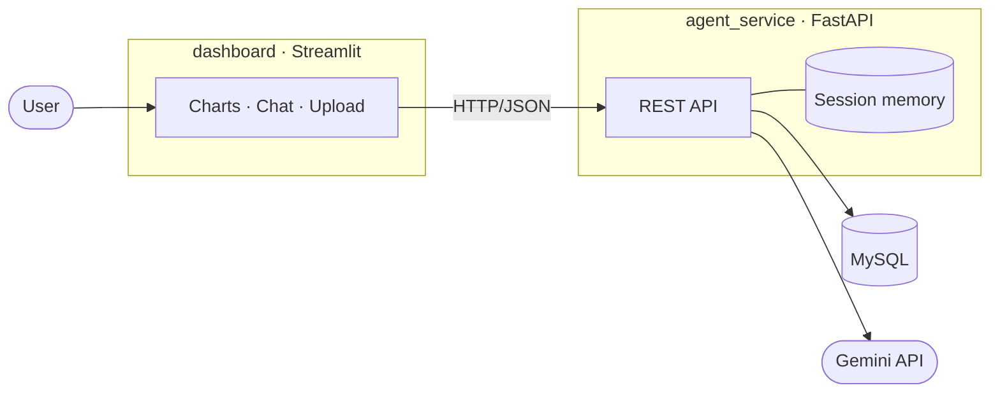

# Finance Agent

An AI agent that reads South African bank statements and answers questions about
your spending in plain English.

Upload a statement (PDF or photo) and the agent extracts every transaction with
a vision model, categorises it through a three-tier pipeline, stores it in MySQL,
and lets you ask follow-up questions in natural language — "How much did I spend
on groceries?", then "and the month before?" — with conversation memory that
makes the follow-up work.

Built as **two independently deployable services** that communicate only over
HTTP.

---

## Architecture



| Service          | Responsibility                                          | Secrets |
|------------------|---------------------------------------------------------|---------|
| `agent_service/` | Statement parsing, categorisation, persistence, chat agent | Gemini key + DB credentials |
| `dashboard/`     | Streamlit UI — charts, upload, chat panel                | **None** — only the API URL |

Each service has its own `pyproject.toml`, lockfile, virtual environment,
`settings.py`, and `Dockerfile`. The dashboard cannot reach the database or the
Gemini API even by accident; it has no credentials and no client libraries for
either. The only contract between the services is the REST API.

---

## How it works

**Statement import** runs as a background job. Parsing takes 10–60 seconds of
Gemini calls, so `POST /statements` validates the file, queues the work, and
returns `202 Accepted` with a job id straight away — the request never holds
the connection open, and the API keeps serving chat and dashboard traffic while
the import runs. The client polls `GET /jobs/{id}` until the job reports `done`
or `failed`, so the UI can show real progress instead of a frozen spinner.

The work itself: page one is rendered to an image and passed to Gemini with a
structured-extraction prompt that returns a JSON array of transactions. The
statement's month is inferred from the *transaction dates themselves* (the
modal month), not from today's date, so importing an old statement files it
correctly. Statements are unique per month, so re-submitting one fails as a
duplicate rather than double-importing — which makes retrying a failed job safe.

**Categorisation** is a cost-conscious waterfall — each tier only runs if the
previous one misses:

1. **Merchant memory** — has this exact description been categorised before?
2. **Keyword rules** — whole-word matching against a seeded rule table
   (word-boundary matching, so `FEE` doesn't match `COFFEE`)
3. **Direction signal** — a credit with no other match is income
4. **Gemini** — a JSON-returning classification call, the only tier that costs
   an API request

Results below a confidence threshold are flagged for human review instead of
being trusted. Only *confirmed* categorisations are written back to merchant
memory, so an unreviewed guess can never quietly promote itself into a fact.
Correcting a transaction in the UI teaches the merchant table directly.

**Chat** uses Gemini tool calling over eight typed database functions
(`get_spending_by_category`, `compare_months`, `get_top_merchants`, …). The
agent picks the tool, the API executes the real query, and the result goes back
to the model to phrase. When no tool fits, it falls back to natural-language →
SQL with a validator that permits only single `SELECT` statements and injects a
row limit.

**Memory** is short-term and per session: the agent service holds one chat
session per `session_id`, so follow-up questions resolve against earlier turns.
Durable knowledge — learned merchants, categories, transactions — lives in MySQL
where it can be corrected, rather than in a conversation transcript where it
would go stale.

---

## Running it

### Docker (recommended)

```bash
cp .env.example .env    # then set GOOGLE_API_KEY
docker compose up --build
```

- Dashboard → http://localhost:8501
- API docs (OpenAPI) → http://localhost:8000/docs

Upload `samples/sample_statement.pdf` to try it — a synthetic three-page
FNB-style statement with 60 invented transactions, generated by
`samples/generate_statement.py` (pure Python, no dependencies). Use it instead
of a real statement: on Gemini's free tier, submitted content may be used to
improve Google's products, so keep genuine financial data out of it.

### Local development

Requires a running MySQL instance and `agent_service/.env`
(see `agent_service/.env.example`).

```bash
uv sync --directory agent_service
uv sync --directory dashboard

uv run --directory agent_service python -m db.seed            # once
uv run --directory agent_service uvicorn api.main:app --port 8000
uv run --directory dashboard streamlit run app.py             # second terminal
```

---

## API

| Method | Endpoint                       | Purpose                                |
|--------|--------------------------------|----------------------------------------|
| POST   | `/statements`                  | Queue a statement import → `202` + job id |
| GET    | `/jobs/{id}`                   | Poll import progress and result        |
| GET    | `/statements`                  | List imported statements               |
| GET    | `/summary?month&year`          | Category breakdown for a month         |
| GET    | `/trend?months`                | Per-month summaries for the trend chart |
| GET    | `/income?month&year`           | Total income for a month               |
| GET    | `/bank-fees?year`              | Monthly bank fee totals                |
| GET    | `/review`                      | Transactions awaiting confirmation     |
| POST   | `/transactions/{id}/confirm`   | Confirm a categorisation               |
| PATCH  | `/transactions/{id}/category`  | Recategorise and teach merchant memory |
| POST   | `/chat`                        | Ask a question (with session memory)   |
| DELETE | `/chat/{session_id}`           | Clear a conversation                   |

---

## Stack

**Agent service** — FastAPI, Google Gemini (`google-genai`), SQLAlchemy, MySQL,
pdf2image + Pillow, pydantic-settings

**Dashboard** — Streamlit, Plotly, httpx

**Infrastructure** — Docker Compose, uv

---

## Design notes

- **Long work never owns a request.** Statement parsing is queued and polled
  rather than awaited, so a slow import cannot stall interactive traffic. The
  background worker opens its own database session, since the request-scoped
  one is closed the moment the `202` is sent.
- **Session-per-request** database handling in FastAPI, rather than a
  long-lived shared session, so a failed transaction can't poison later requests.
- **Confidence-gated automation** — the agent defers to a human review queue
  instead of guessing silently, and only learns from confirmed decisions.
- **Stateful chat, stateless data path** — chat memory lives in process, which
  means the agent service currently expects session affinity. Moving that store
  to Redis is the change required to scale it horizontally.
- **Duplication over coupling** — the two services share no code. That is a
  deliberate trade: a little repetition buys genuinely independent deploys.
- **A model per role.** Parsing, categorising, and chat each point at their own
  Gemini model. They have genuinely different needs — vision, cheap bulk
  classification, tool calling — and since free-tier request quota is enforced
  per model, separating them also triples the usable daily budget.
